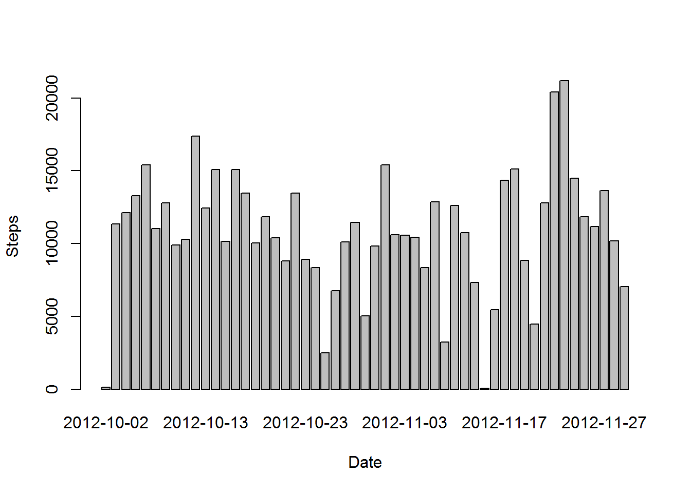
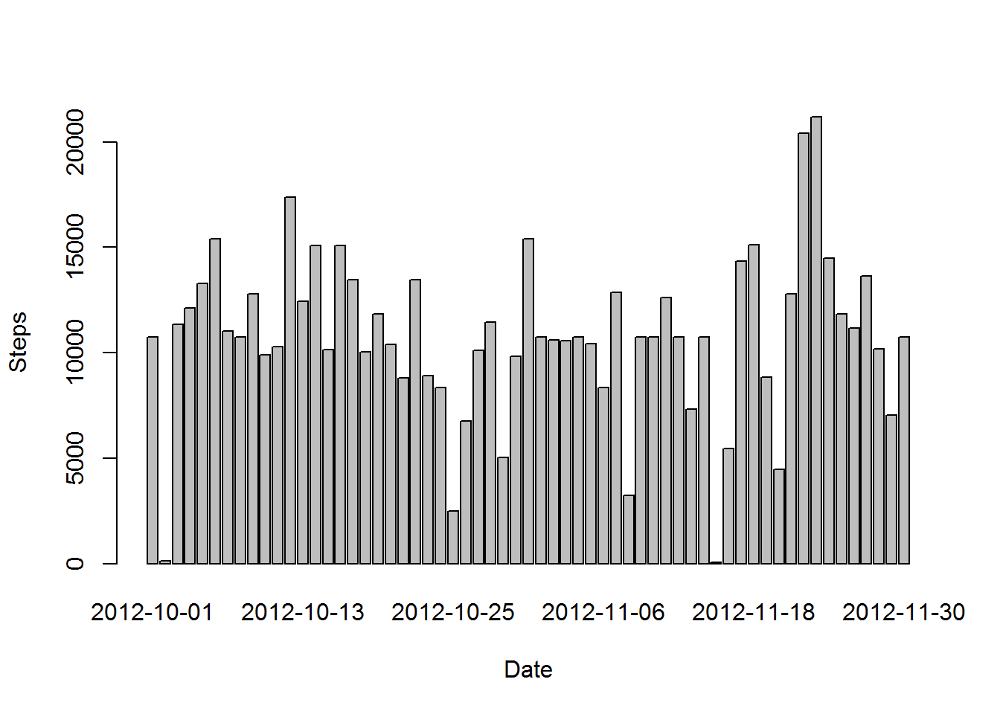
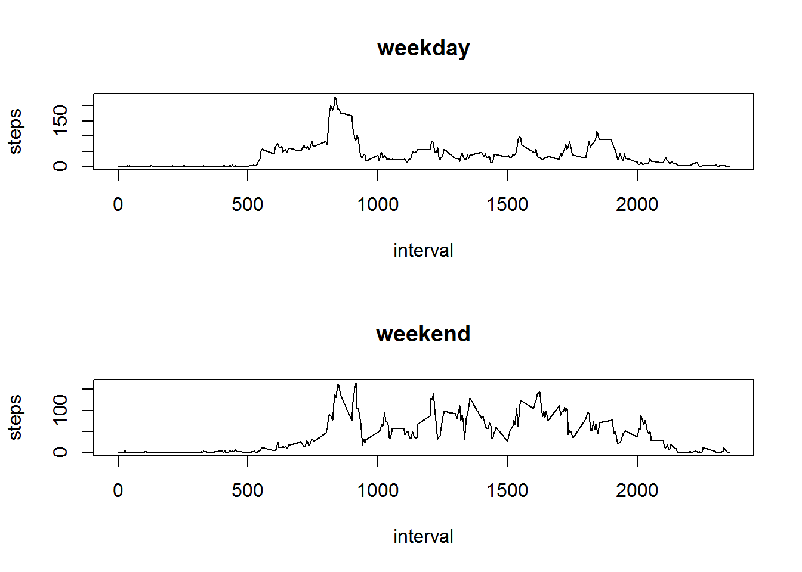

# Project Assignment 1

#Loading and preprocessing the data

What is mean total number of steps taken per day?

1. Read the csv file. Hint : Use the read.csv() function

```r
library(ggplot2)
```

```
## Warning: package 'ggplot2' was built under R version 3.2.2
```

```r
library(knitr)
```

```
## Warning: package 'knitr' was built under R version 3.2.2
```

```r
file<-("C:/Users/WW/Documents/RepData/activity.csv")
MyData<-read.csv(file,header = TRUE, sep = ",")
```
For this part of the assignment, you can ignore the missing values in the dataset.

2. The total number of steps taken per day

```r
steps.perday <- aggregate(steps ~ date, MyData, FUN = sum)
steps.perday
```

```
##          date steps
## 1  2012-10-02   126
## 2  2012-10-03 11352
## 3  2012-10-04 12116
## 4  2012-10-05 13294
## 5  2012-10-06 15420
## 6  2012-10-07 11015
## 7  2012-10-09 12811
## 8  2012-10-10  9900
## 9  2012-10-11 10304
## 10 2012-10-12 17382
## 11 2012-10-13 12426
## 12 2012-10-14 15098
## 13 2012-10-15 10139
## 14 2012-10-16 15084
## 15 2012-10-17 13452
## 16 2012-10-18 10056
## 17 2012-10-19 11829
## 18 2012-10-20 10395
## 19 2012-10-21  8821
## 20 2012-10-22 13460
## 21 2012-10-23  8918
## 22 2012-10-24  8355
## 23 2012-10-25  2492
## 24 2012-10-26  6778
## 25 2012-10-27 10119
## 26 2012-10-28 11458
## 27 2012-10-29  5018
## 28 2012-10-30  9819
## 29 2012-10-31 15414
## 30 2012-11-02 10600
## 31 2012-11-03 10571
## 32 2012-11-05 10439
## 33 2012-11-06  8334
## 34 2012-11-07 12883
## 35 2012-11-08  3219
## 36 2012-11-11 12608
## 37 2012-11-12 10765
## 38 2012-11-13  7336
## 39 2012-11-15    41
## 40 2012-11-16  5441
## 41 2012-11-17 14339
## 42 2012-11-18 15110
## 43 2012-11-19  8841
## 44 2012-11-20  4472
## 45 2012-11-21 12787
## 46 2012-11-22 20427
## 47 2012-11-23 21194
## 48 2012-11-24 14478
## 49 2012-11-25 11834
## 50 2012-11-26 11162
## 51 2012-11-27 13646
## 52 2012-11-28 10183
## 53 2012-11-29  7047
```

3. Make a histogram of the total number of steps taken each day

```r
barplot(steps.perday$steps, names.arg = steps.perday$date, xlab = "Date", ylab = "Steps")
```

 

4. The mean and median of the total number of steps taken per day

```r
mean(steps.perday$steps)
```

```
## [1] 10766.19
```

```r
median(steps.perday$steps)
```

```
## [1] 10765
```

#What is the average daily activity pattern?

5. Make a time series plot (i.e. type = "l") of the 5-minute interval (x-axis) and the average number of steps taken, averaged across all days (y-axis)

```r
steps.interval<- aggregate(steps ~ interval, MyData, FUN = mean)
plot(steps.interval, type = "l")
```

 

6. Which 5-minute interval, on average across all the days in the dataset, contains the maximum number of steps?

```r
steps.interval$interval[which.max(steps.interval$steps)]
```

```
## [1] 835
```

```r
#835
```

#Missing values

7. Note that there are a number of days/intervals where there are missing values (coded as NA).Calculate and report the total number of missing values in the dataset (i.e. the total number of rows with NAs)

```r
sum(is.na(MyData))
```

```
## [1] 2304
```

```r
#2304
```

8. Devise a strategy for filling in all of the missing values in the dataset. The strategy does not need to be sophisticated. For example, you could use the mean/median for that day, or the mean for that 5-minute interval, etc.

*I prefer to use the means for the 5-minute intervals as fillers for missing values in the datasets.

9. Create a new dataset that is equal to the original dataset but with the missing data filled in.

```r
MyData <- merge(MyData, steps.interval, by = "interval", suffixes = c("", 
    ".y"))
nas <- is.na(MyData$steps)
MyData$steps[nas] <- MyData$steps.y[nas]
MyData <- MyData[, c(1:3)]
```

10. Make a histogram of the total number of steps taken each day and Calculate and report the mean and median total number of steps taken per day. 

```r
steps.perday <- aggregate(steps ~ date, MyData, FUN = sum)
barplot(steps.perday$steps, names.arg = steps.perday$date, xlab = "Date", ylab = "Steps")
```

 

```r
mean(steps.perday$steps)
```

```
## [1] 10766.19
```

```r
median(steps.perday$steps)
```

```
## [1] 10766.19
```

11. Do these values differ from the estimates from the first part of the assignment?
The value just a little different in decimal only. 

12. What is the impact of imputing missing data on the estimates of the total daily number of steps?
The impact is so minimal.

#Differences in activity patterns between weekdays and weekends?

13. For this part the weekdays() function may be of some help here. Use the dataset with the filled-in missing values for this part.Create a new factor variable in the dataset with two levels - "weekday" and "weekend" indicating whether a given date is a weekday or weekend day.

```r
daytype <- function(date) {
    if (weekdays(as.Date(date)) %in% c("Saturday", "Sunday")) {
        "weekend"
    } else {
        "weekday"
    }
}
MyData$daytype <- as.factor(sapply(MyData$date, daytype))
```

14. Make a panel plot containing a time series plot (i.e. type = "l") of the 5-minute interval (x-axis) and the average number of steps taken, averaged across all weekday days or weekend days (y-axis).

```r
par(mfrow = c(2, 1))
for (type in c("weekday", "weekend")) {
    steps.type <- aggregate(steps ~ interval, MyData, subset = MyData$daytype == 
        type, FUN = mean)
    plot(steps.type, type = "l", main = type)
}
```

 

From both graph we can see that the activity on the weekday has the highest peak from all steps intervals. For the weekends activities, it has many peaks that passed 100 than weekday. This is due to we tend to have routine activity during weekdays but there a some changes in weekend as there are many things that can be done. 
